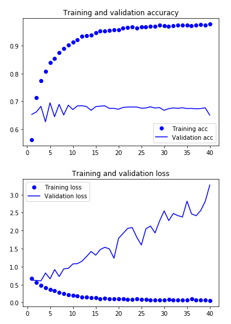

# Model training on IMDB Reviews Data set

The plot given below shows the process of training. It shows the accuracy achieved while training the model and also the corresponding training and validation loss values.

### Results obtained

The results obtained during the evaluation of the best model and last model are shown in the table below:

|Model Type|Accuracy  |
|:--------:|:--------:|
|Best Model|65.52     |
|Last Model|69.61     |
